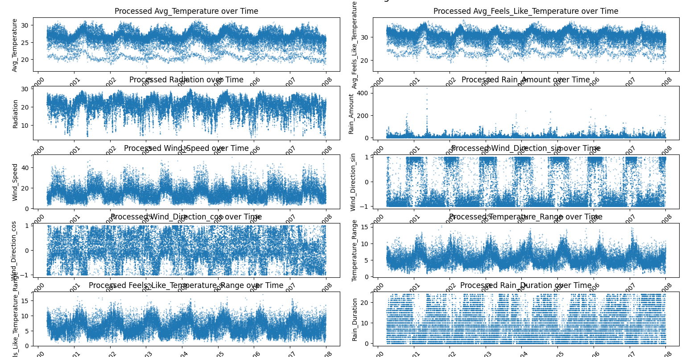

# The Future of Harveston ML Prediction - Data Crunch 102

## Prophet Weather Forecasting with Optuna Optimization

### Overview

This project uses Facebook's Prophet time series forecasting library to predict multiple weather variables based on historical data. It leverages the Optuna optimization framework to automatically tune Prophet's hyperparameters for improved accuracy. The script processes data for different geographical regions ('kingdoms'), builds independent models for each target variable within each region, and generates a submission-ready CSV file with predictions.

### Features

- **Time Series Forecasting:** Utilizes Prophet for robust time series prediction.
- **Multi-Target Prediction:** Models and predicts `Avg_Temperature`, `Radiation`, `Rain_Amount`, `Wind_Speed`, and `Wind_Direction`.
- **Regional Modeling:** Builds separate models for each distinct 'kingdom' present in the data.
- **Data Preprocessing:** Includes steps for:
  - Handling date/time columns (creating Prophet's required 'ds' column).
  - Converting temperatures from Kelvin to Celsius.
  - Ensuring numeric data types.
  - Handling NaN/Infinity values.
  - Clipping outliers based on percentile thresholds.
- **Hyperparameter Optimization:** Employs Optuna to find the best hyperparameters for each Prophet model by minimizing Mean Absolute Error (MAE) on a validation set. Tuned parameters include prior scales and seasonality Fourier orders.
- **Validation Strategy:** Uses a time-based split (e.g., 80% train, 20% validation) for evaluating hyperparameters during optimization.
- **Submission File Generation:** Produces a CSV file (`submission_prophet_optuna.csv`) in the standard format with an 'ID' column and predicted values for each target variable.

### Dependencies

Ensure you have the following libraries installed:

```bash
pip install pandas prophet numpy optuna scikit-learn matplotlib seaborn
```

*(matplotlib/seaborn are included for visualization but not strictly required for the forecasting script itself.)*

### Usage

1. **Place Data Files:** Ensure `train.csv` and `test.csv` are in the same directory as the Python script.
2. **Run the Script:** Execute the script from your terminal:

   ```bash
   python script.py
   ```

  

3. **Output:** The script will print progress updates, including validation MAE summaries, and generate the `submission_prophet_optuna.csv` file.

### Learning Process Workflow

1. **Load Data:** Reads `train.csv` and `test.csv`.
2. **Preprocess Data:**
   - Cleans the data using the `preprocess_data` function.
   - Creates the 'ds' datetime column for Prophet.
   - Converts temperatures to Celsius.
   - Handles missing values.
   - Clips outliers.
3. **Iterative Modeling (Per Kingdom, Per Target):**
   - Loops through each unique kingdom and each target variable.
   - Creates individual models for different regions and weather variables.
4. **Hyperparameter Optimization (Optuna - Validation Phase):**
   - Splits training data (e.g., 80% train, 20% validation).
   - Runs multiple Optuna trials to tune Prophet hyperparameters.
   - Uses Mean Absolute Error (MAE) as the evaluation metric.
5. **Final Model Training:**
   - Trains the best-found Prophet model on the entire dataset.
6. **Prediction:**
   - Uses trained models to forecast target variables for test set dates.
7. **Post-processing & Submission:**
   - Clips predictions within valid ranges.
   - Merges results into a final submission file.
   - Saves as `submission_prophet_optuna.csv`.

### Data Visualization Insights

#### Raw Data

- **Histograms:** Help identify unusual distributions and outliers.
  

- **Time Series Plots:** Reveal seasonality, trends, and gaps in data.
  

#### Processed Data

- **Histograms after preprocessing:** Show cleaned distributions.
  

- **Time Series Plots after preprocessing:** Present consistent temperature scales and reduced outliers.
  

### Hyperparameter Tuning with Optuna

Optuna automates the search for optimal Prophet settings. It iteratively suggests parameter combinations that minimize validation MAE.


### Configuration

Key parameters can be adjusted in the script:

- `TRAIN_FILE`, `TEST_FILE`, `SUBMISSION_FILE`: File paths.
- `TARGET_VARIABLES`: List of target columns.
- `NON_GEO_REGRESSORS`, `GEO_REGRESSORS`: Feature sets.
- `VALIDATION_SPLIT_PERCENTAGE`: Proportion of data used for training in Optuna trials.
- `N_OPTUNA_TRIALS`: Number of Optuna trials per model.
- `MULTIPLICATIVE_VARS`: Variables needing multiplicative seasonality.

### Potential Improvements

- **Advanced Feature Engineering:** Add lag features or rolling averages.
- **Handling Wind Direction:** Use sine/cosine transformations.
- **Holidays/Special Events:** Incorporate seasonal event data.
- **Cross-Validation:** Implement rolling forecast validation.
- **Alternative Models:** Compare with ARIMA, LSTMs, or GRUs.
- **Regressor Forecasting:** Predict key regressors for better modeling.

This project provides a strong foundation for weather forecasting using Prophet and Optuna. Further enhancements can be explored based on dataset complexity and forecasting requirements.
